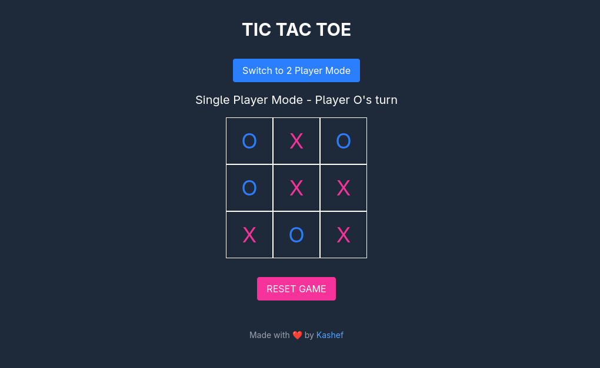

# 🎮 Tic Tac Toe - Vue 3 + Vite

A modern, responsive Tic Tac Toe game built with **Vue 3**, **Vite**, and **Tailwind CSS**.
Supports both **Single Player** mode (with a basic AI opponent) and **Two Player** local mode.


---

## ✨ Features

* ✅ Play against a simple AI (Single Player)
* 👯 Play with a friend (Two Player)
* 🧠 AI can block, win, and take smart positions
* 🎨 Beautiful UI with Tailwind CSS
* ⚡ Built with fast and modern Vite + Vue 3 stack
* 🌙 Dark theme support
* 📱 Responsive design

---

## 🚀 Live Demo

🌐 [Play Online](https://kashef-ir.github.io/TicTacToe)

---

## 🛠️ Tech Stack

* [Vue 3 (Composition API)](https://vuejs.org/)
* [Vite](https://vitejs.dev/)
* [Tailwind CSS](https://tailwindcss.com/)
* [GitHub Pages](https://pages.github.com/)

---

## 📦 Setup & Build

### 1. Clone the repository

```bash
git clone https://github.com/kashef-ir/TicTacToe.git
cd TicTacToe
```

### 2. Install dependencies

```bash
npm install
```

### 3. Run the dev server

```bash
npm run dev
```

### 4. Build for production

```bash
npm run build
```

### 5. Deploy to GitHub Pages

```bash
npm run deploy
```

> Make sure your `vite.config.js` has `base: '/TicTacToe/'` set correctly.

---

## 🎮 Game Modes

* **Single Player**: Play against a simple AI (AI = O). Player always starts as X.
* **Two Player**: Local play on the same device. Take turns by clicking cells.

Use the toggle button to switch between modes.

---

## 📌 License

This project is open source and available under the [MIT License](LICENSE).

---

## 🤝 Contributing

Pull requests are welcome!
Want to improve the AI, add animations, or make it multiplayer? Feel free to fork and contribute.

---

## 🧠 Future Ideas

* Smarter AI using Minimax algorithm
* Sound effects on move/win
* Score tracking and leaderboard
* Touch gesture support for mobile
* Persistent game state

---

### Made with ❤️ by Kashef

---
